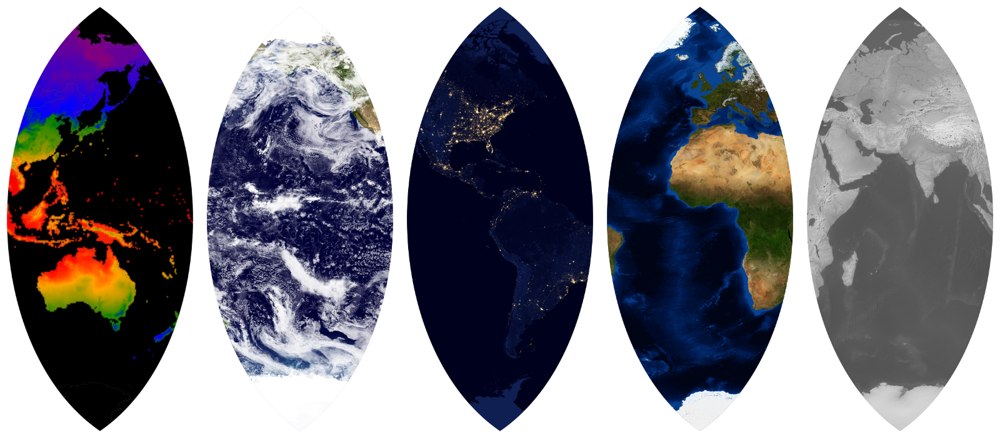

Map Gores
=========

The Node.js script in this repository can be used to draw globe gores, i.e. an [interrupted map](http://www.progonos.com/furuti/MapProj/Normal/ProjInt/projInt.html) made out of pieces that could be pasted onto the surface of a sphere.

Here is a composite of gores from multiple source raster/vector sources:

From left to right:

* [CRU TS3.24.01 (Jan. 1901- Dec. 2015)](http://catalogue.ceda.ac.uk/uuid/3df7562727314bab963282e6a0284f24), mean daily temperatures 2011-2015, Centre for Environmental Data Analysis, University of East Anglia Climatic Research Unit (Harris, I.C.; Jones, P.D. (2017)). (The data is used under a license -- please retain the attribution above if you reuse the image.) With [Natural Earth](http://www.naturalearthdata.com/downloads/) country vector outlines.

* [NASA Goddard Space Flight Center - Blue Marble (2002, land surface, ocean color, sea ice and clouds)](http://visibleearth.nasa.gov/view.php?id=57735)
	
* [NASA Earth Observatory - Night Lights (2012)](http://visibleearth.nasa.gov/view.php?id=79765)

* [NASA Earth Observatory - Blue Marble Next Generation (December 2004) with Topography and Bathymetry](http://visibleearth.nasa.gov/view.php?id=73909)

* [Natural Earth - Gray Earth with Shaded Relief, Hypsography, Ocean Bottom, and Drainages](http://www.naturalearthdata.com/downloads/10m-raster-data/10m-gray-earth/)

Mathematics
-----------

The gores are made from the center diamond-y region of the [Lambert Azimuthal Equal Area](https://en.wikipedia.org/wiki/Lambert_azimuthal_equal-area_projection) projection. Each gore is made by rotating the projection around the earth so that a different part is in view for each gore.

The selection of projection was based on these goals:

* The area bounded by symmetric lines of longitude around the central meridian must be a shape that looks like a [globe gore](https://en.wikipedia.org/wiki/Gore_%28segment%29). A projection like the normal Mercator would produce rectangular strips when cut up because lines of longitude are parallel, and that won't fit on a sphere.

* The projection should be conformal. A conformal projection preserves shape. That's important because a non-conformal projection will create abrupt distortions where two gores come together, because the distortion at the edge of one gore won't be the same as the distortion on the adjancent edge of the next gore.

* The projection should be equal-area, meaning all parts of the earth are given an equal amount of space in the map. Without this property, the map/globe will stretch some parts of the earth and shrink others (like how Mercator stretches the poles and shrinks things at the equator).

A map can't be both conformal and equal area, so a projection that is almost conformal and doesn't have too much distortion in scale is probably best. And no flat print-out will lay perfectly on a sphere. There will be some distortion as the material is stretched to fit on a sphere. So perfect conformality when projected onto a rectangular image will turn into non-conformality on a sphere anyway.

The contenders are:

### [Transverse Mercator](https://en.wikipedia.org/wiki/Transverse_Mercator_projection)

Pro: Conformal. Con: Distortion in size increases as you go horizontally away from the central meridian, but since gores aren't very wide the distortion is mostly in the parts of the map that don't fall in the center part that makes a gore.

### [Lambert Azimuthal Equal Area projection](https://en.wikipedia.org/wiki/Lambert_azimuthal_equal-area_projection)

Pro: Equal-area. Con: Distortion in shape increases as you go horizontally away from the central meridian, but there is relatively little distortion close to the central meridian. If we're making flat art and not an actual globe, so we won't notice non-conformality, this perhaps produces the most equitable map.

### [Sinusoidal](https://en.wikipedia.org/wiki/Sinusoidal_projection)

Pro: Equal-area. Con: Large distortions in shape near the center (less distortion away from the center, but we don't care about that).

### [Polyconic](https://en.wikipedia.org/wiki/Polyconic_projection)

Neither equal-area nor conformal, but pretty close to both. Plausibly the best choice for an actual gore by taking a middle road.

For more on valuable aspects of projections for globe gores, see [https://www.mapthematics.com/Downloads/Gores.pdf](https://www.mapthematics.com/Downloads/Gores.pdf).

Implementation
--------------

The gore is created by using:

* `gdalwarp` to draw a base layer from a GeoTIFF raster image
* vector data in a GeoJSON file
* the Cario graphics drawing library, which creates high-quality raster images

To run:

Install the node-canvas (a Cairo wrapper) dependencies for your platform:

	https://github.com/Automattic/node-canvas

Install node dependencies:

	npm install

Fetch GIS data:

	./fetch_world_data.sh

Generate the map:

	# node index.js num_gores prime_meridian map_height raster_tiff
	node index.js 13 -77.036366 512 HYP_50M_SR_W/HYP_50M_SR_W.tif

Edit the parameters at the top of index.js for a larger map or to change the number of gores.

GeoTIFF Sources
---------------

* [Natural Earth](http://www.naturalearthdata.com/downloads/) (shaded relief; up to 21,600x10,800)
* [Visible Earth (NASA)](http://visibleearth.nasa.gov/) ([blue marble](http://visibleearth.nasa.gov/view_cat.php?categoryID=1484), [night lights](http://visibleearth.nasa.gov/view.php?id=79765); up to 54,000x27,000)

Weather Data
------------

The U.S. National Weather Service's Global Forecast System (GFS) offers real-time(-ish) global weather data through [NOMADS](http://nomads.ncep.noaa.gov/) in the GRIB2 format. The author of https://github.com/cambecc/earth figured out how to pull a slice of the data from the 1-degree resolution dataset.

	YYYYMMDD=$(date --iso-8601=date | sed s/-//g)
	curl "http://nomads.ncep.noaa.gov/cgi-bin/filter_gfs.pl?file=gfs.t00z.pgrb2.1p00.f000&lev_10_m_above_ground=on&var_UGRD=on&var_VGRD=on&dir=%2Fgfs.${YYYYMMDD}00" -o gfs.t00z.pgrb2.1p00.f000

Other Data Sources
------------------

See https://github.com/cambecc/earth for how to get global weather data.
