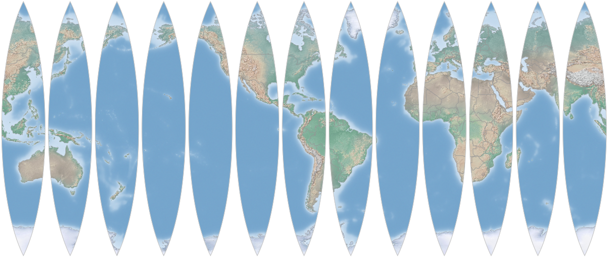
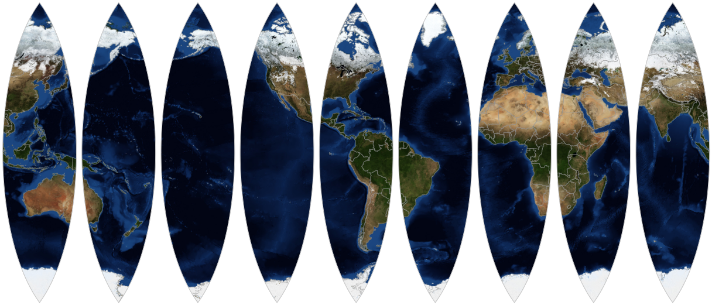

Map Gores
=========

The Node.js script in this repository can be used to draw globe gores, i.e. an [interrupted map](http://www.progonos.com/furuti/MapProj/Normal/ProjInt/projInt.html) made out of pieces that could be pasted onto the surface of a sphere.

	
[high res (16M)](output_large.png), [Natural Earth](http://www.naturalearthdata.com/downloads/) raster and vector data

[high res (7M)](output_blue_large.png), [Blue Marble/NASA](http://neo.sci.gsfc.nasa.gov/view.php?datasetId=BlueMarbleNG-TB) raster and [Natural Earth](http://www.naturalearthdata.com/downloads/) country vector data

Mathematics
-----------

The gores are made from the center region of the [Lambert Azimuthal Equal Area projection](https://en.wikipedia.org/wiki/Lambert_azimuthal_equal-area_projection) bounded by symmetric lines of longitude:

I chose this projection because:

* The area bounded by symmetric lines of longitude around the central meridian is a shape that looks like a [globe gore](https://en.wikipedia.org/wiki/Gore_%28segment%29). Cylindrical projections like Mercator wouldn't work --- they would produce rectangular strips. Other plausible projections include [sinusoidal](https://en.wikipedia.org/wiki/Sinusoidal_projection) and [polyconic](https://en.wikipedia.org/wiki/Polyconic_projection).
* It is an equal-area projection, which means the map doesn't give more area to some parts of the world than others --- and that's just fair. (Sinusoidal would also work, but not polyconic.)
* It's roughly shape-preserving, e.g. the lines of latitude intersect the lines of longitude at very close to right angles near the center line of longitude, which means that if the gores were actually placed on a sphere there wouldn't be abrupt changes where the gores meet. (Sinusoidal is less shape-preserving, polyconic may be more.)

(For real globe gores, shape-preserving is probably most valuable so there aren't abrupt angles at the intersections of the gores. Polygonic might be more shape-preserving, and might ultimately fit a sphere better. But since you probably won't be putting these gores on an actual globe, prioritizing equal-area makes more sense to me, and I had trouble using polygonic in practice. For more on valuable aspects of projections for globe gores, see [https://www.mapthematics.com/Downloads/Gores.pdf](https://www.mapthematics.com/Downloads/Gores.pdf).)

Each gore is created by making a separate projection centered at a different line of longitude, rotating around the earth.

Implementation
--------------

The gore is created by using:

* `gdalwarp` to draw a base layer from a GeoTIFF raster image
* vector data in a GeoJSON file

To run:

Install the node-canvas dependencies for your platform:

	https://github.com/Automattic/node-canvas

Install node dependencies:

	npm install

Fetch GIS data:

	./fetch_world_data.sh

Generate the map:

	# node index.js num_gores prime_meridian map_height raster_tiff
	node index.js 13 -77.036366 512 HYP_50M_SR_W/HYP_50M_SR_W.tif

Edit the parameters at the top of index.js for a larger map or to change the number of gores.

